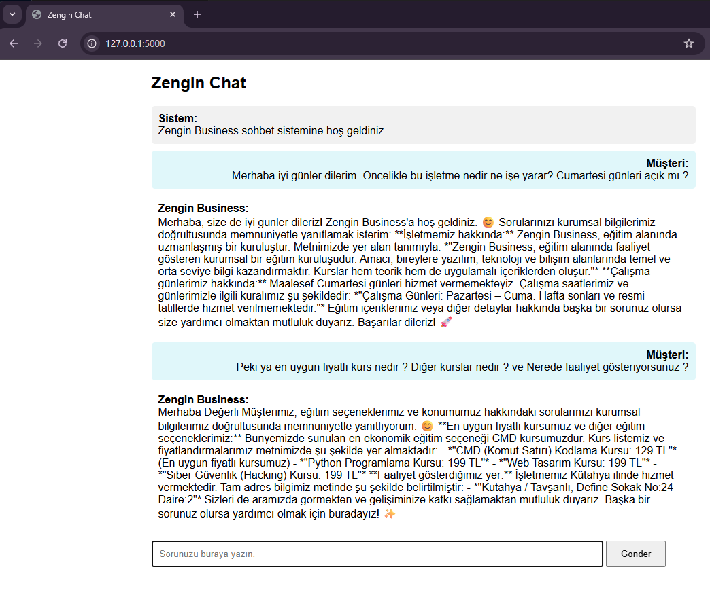

# AI destekli chatbot

Bu projede flask kullanarak yapay zekâ destekli basit bir chatbot sistemi geliştirdim. Google Gemini API ile çalışıyor ve kullanıcıyla sohbet edebiliyor. Daha çok generative ai tarafını öğrenmek ve api entegrasyonu pratiği yapmak için yaptım.

Genel mantık:
Kullanıcı mesaj gönderir -> prompt işlenir -> gemini cevap üretir -> ekranda gösterilir

---

Sistem şu şekilde çalışıyor:

Kullanıcının mesajı flask tarafında alınıyor. Daha sonra belirlediğim prompt yapısıyla birlikte Gemini API’ye gönderiliyor. Modelden gelen cevap tekrar kullanıcıya gösteriliyor. Chatbot’un tamamen serbest cevap vermemesi için bazı kurallar ve davranışlar tanımladım.

Mesela: daha kurumsal konuşması, belirli konu dışına çıkmaması, müşteri gibi cevap vermesi gibi şeyler ekledim.

---

Projede yaptığım şeyler:  
Flask ile backend tarafını kurdum, gemini api entegrasyonu yaptım, basit arayüz hazırladım, prompt yapısını düzenledim, kullanıcı mesajlarını işledim.

---

Kullandığım teknolojiler:  
Python 3.10, flask, google gemini api, html / css, jinja2

---

Not:  
Bu proje tamamen öğrenme amaçlı geliştirildi. Özellikle generative ai ve prompt mantığını anlamak için yaptım. Gerçek bir kurumsal sistem değil.

---

Çalıştırmak için:

pip install google-generativeai flask

python app.py

---

Ekran görüntüsü:

