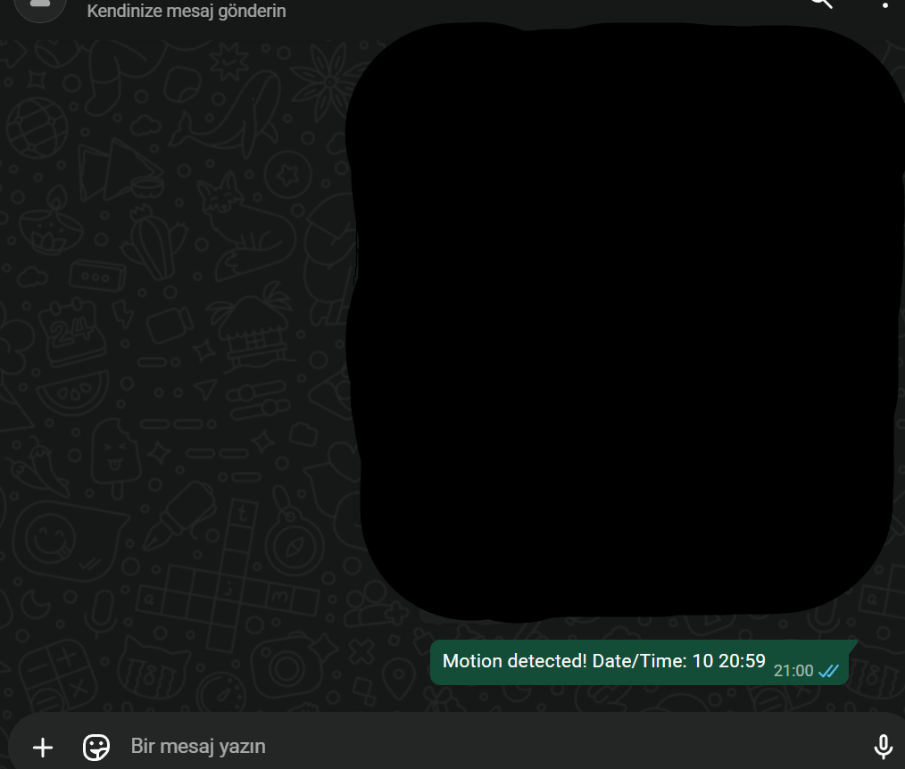

# Hareket algılama ve whatsapp bildirim sistemi

Bu projede webcam üzerinden hareket algılayan basit bir sistem yaptım.  
Hareket algılandığında otomatik olarak WhatsApp üzerinden mesaj gönderiyor.

Çok profesyonel bir şey değil, daha çok computer vision ve otomasyon mantığını anlamak için yaptım.

Genel mantık:
Kameradan görüntü al -> Hareket var mı bak -> Varsa mesaj gönder

---

Kullandığım teknolojiler:  
python  
opencv  
pyautogui  
whatsapp web  

---

Sistem şu şekilde çalışıyor:

Webcam sürekli açık kalıyor ve görüntüyü kare kare işliyorum.  
Arka planı öğrenip, hareket eden bir şey olup olmadığını kontrol ediyorum.
Eğer belirli bir seviyenin üstünde hareket varsa:
WhatsApp Web üzerinden otomatik mesaj gönderiliyor.
Spam olmaması için de küçük bir bekleme süresi koydum.

---

Hareket algılama kısmı:

Arka plan çıkarma (mog2) kullandım  
Gürültüyü azaltmak için biraz filtreleme yaptım  
Küçük hareketleri direkt saymıyorum (yanlış alarm olmasın diye)
En son kontur alanına bakarak gerçekten hareket var mı karar veriyor

---

WhatsApp kısmı:

WhatsApp Web üzerinden çalışıyor  
pyautogui ile klavye/mouse kontrolü yapıyorum  
Mesajı otomatik yazıp gönderiyor

---

Not:

Bu proje tamamen deneme amaçlı  
gerçek bir güvenlik sistemi falan değil  

---

Çalıştırmak için:

pip install -r requirements.txt  
python main.py

---

Ekran görüntüsü:

